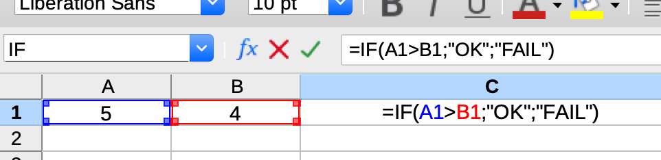

# Functional programming

Una raccolta di idee e spunti

---

# Fonti di ispirazione - 1: Codemotion talk:

**Jemima Abu**

"Let's get functional"

https://talks.codemotion.com/lets-get-functional?_ga=2.199840302.1675421665.1650872817-1307759326.1650872817&_gl=1%2a1w6mr7n%2a_ga%2aMTMwNzc1OTMyNi4xNjUwODcyODE3%2a_ga_52S30H0VCG%2aMTY1MDkxNTUwOS4zLjEuMTY1MDkxNTY1NS4w

Concetti base

---

# Fonti di ispirazione - 2: Codemotion talk:

**Luca Cavallaro**

Funzionale è facile con TypeScript

https://talks.codemotion.com/funzionale--facile-con-typescript?_ga=2.134894065.1675421665.1650872817-1307759326.1650872817&_gl=1%2akkbogm%2a_ga%2aMTMwNzc1OTMyNi4xNjUwODcyODE3%2a_ga_52S30H0VCG%2aMTY1MDg3Mjg0OC4xLjEuMTY1MDg3MzA1OS4w

---

# Vantaggi della programmazione funzionale

* Meno errori

* Più facili da testare e _debuggare_

* Più facili da riutilizzare
---
# Come e quando usare uno stile funzionale

## Python / JS / Java / Go non sono funzionali puri
Non sempre, non necessariamente al 100%

## Per implementare singole sezioni di logica e workflow

## Per implementare workflow e gestire side effect in modo controllato

---

# Valori (Caratteristiche) della programmazione funzionale / 1

## Funzioni pure
- Restituiscono sempre e solo valori
- **Sostituibili con i valori restituiti**

## Immutabilità dei valori

## Trasparenza referenziale

---

# Valori (Caratteristiche) della programmazione funzionale / 2

## Divide et impera
Funzioni piccole e focalizzate
## Funzioni come entità "first class"

- Argomenti di funzioni
- Non legate a strutture

## Idealmente nessun side effect

---

# Valori (Caratteristiche) della programmazione funzionale / 3

## Approccio dichiarativo

Aspetto dichiarativo prevalente.

---

# Valori (Caratteristiche) della programmazione funzionale / 4

## Composizione di funzioni

La composizione di funzioni sta alla base di tutto

## Best fit con linguaggi fortemente tipizzati

La composizione ha come prerequisito la compatibilità dei tipi

---

# Valori (Caratteristiche) della programmazione funzionale / 5

## Radicato nella nostra cultura: Excel / Haskell

.

```Haskell
risultato :: Int -> Int -> String
risultato a b = if a > b then "OK" else "FAIL"


main = putStrLn (risultato 5 4)
```

---


# Funzioni "totali" / 1

Definite per tutti i possibili valori di input

```python
def exp2(x):
    return 2**x
```

---

# Funzioni totali / 2

Un **contro**esempio

```python
def reciproco(x):
    return 1.0 / x
```

---

# Funzioni totali / 3

Metodo 1 : Restringere input

```python
x != 0

1.0 / x == ":-)"
```

---

# Funzioni totali / 4

Metodo 2 : Allargare l'output -> Dare un "contesto"

```python
class Risultato
    valore: float
    successo: boolean

```

---
# Funzioni totali / 5

Altre idee: Pattern Null Object

Il patern Null Object implementa l'idea stessa di avere un output "in ogni caso"

Implementa un concetto (quasi puramente) funzionale in ambito oop

---

# Elementi cardine dello sviluppo funzionale

## Composizione

## Gestione dei side effect

---

# Composizione

La composizione può essere vista come un concatenamento
(es. "pipe")


.

---

# Composizione

Nel caso di composizioni complesse si ~~vuole~~ può volere evitare una situazione simile alla seguente...

```

step1 = funzione_1(parametri_iniziali)

step2 = funzione_2(step1, p2, p3...)

...

risultato = funzione_n(step_n_meno_1, px, py...)

```

---

# Composizione

... oppure anche:

```

risultato = (
    ...
            funzione_3(
                funzione_2(
                    funzione_1(parametri_iniziali)
                )
            )
    ...
)

```

---

# Composizione

Una possibile soluzione:

```
..._..._platform/common/utils.py
def chain_functions(...)

```

---

# Come integrare i side effect nel mondo funzionale / 1

## Injection
Passare lo "step successivo" come parametro

inject.py

---

# Come integrare i side effect nel mondo funzionale / 2


## Sostituzione del side effect con una sua rappresentazione
"Barare e procrastinare"
    * "Barare" = Di fatto le funzioni non sono pure
    * "Procrastinare" = Incapsulare in una funzione.
    Un side effect infatti non è tale finché non avviene.

---

# Come integrare i side effect nel mondo funzionale / 2

## Allargamento dell'output

* Ritornare sempre un valore
* Ritornare un valore che rappresenta un errore al posto di sollevare un'eccezione

---

# Come integrare i side effect nel mondo funzionale / 2

## Gestione dei side effect

Sostituzione di un side effect con un valore che lo rappresenta (tipicamente una lambda), in modo tale da diventare indistinguibile da esso

Le funzioni pure non sono pure (nel senso che i side effect ci sono) solamente possono essere viste e sostituite con il loro valore

Un side effect infatti non è tale finché non avviene.

---

# Come integrare i side effect nel mondo funzionale / 3

## Composizione come concatenamento

Si vogliono "collegare" pezzi di logica tra loro tenendoli disaccoppiati

Si vuole dare un workflow orizzontale/sequenziale


# Come integrare i side effect nel mondo funzionale / 3


Tool di concatenamento


---

# Come integrare i side effect nel mondo funzionale / 3


workflow.py