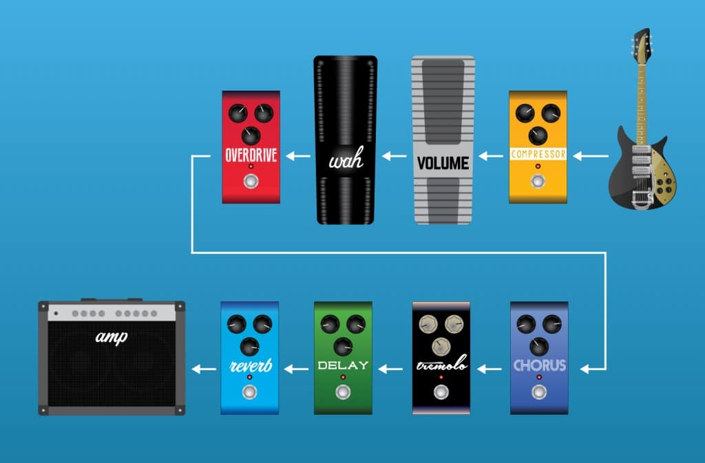

# Functional programming

Una raccolta di idee e spunti

---

# Vantaggi della programmazione funzionale

* Meno errori

* Più facili da testare e _debuggare_

* Più facili da riutilizzare
---
# Come e quando usare uno stile funzionale

## Python / JS / Java / Go non sono funzionali puri
Non sempre, non necessariamente al 100%

## Per implementare singole sezioni di logica e workflow

## Per implementare workflow e gestire side effect in modo controllato

---

# Valori (Caratteristiche) della programmazione funzionale / 1 

## Funzioni pure
- Restituiscono sempre e solo valori
- Sostituibili con funzioni che restituiscono solo valori 

## Immutabilità dei valori

## Trasparenza referenziale

---

# Valori (Caratteristiche) della programmazione funzionale / 2

## Divide et impera 
Funzioni piccole e focalizzate
## Funzioni come entità "first class"

- Argomenti di funzioni
- Non legate a strutture

## Idealmente nessun side effect 

---
 

# Valori (Caratteristiche) della programmazione funzionale / 3

## Composizione di funzioni 

La composizione di funzioni sta alla base di tutto

## Best fit con linguaggi fortemente tipizzati

La composizione ha come prerequisito la compatibilità dei tipi

---
 

# Funzioni "totali" / 1

Definite per tutti i possibili valori di input

```python
def exp2(x):
    return 2**x
```

---
 
# Funzioni totali / 2

Un **contro**esempio

```python
def reciproco(x):
    return 1.0 / x
```

---
 
# Funzioni totali / 3

Metodo 1 : Restringere input

```python
x != 0

1.0 / x == ":-)" 
```

---
 
# Funzioni totali / 4

Metodo 2 : Allargare l'output -> Dare un "contesto"

```python
class Risultato
    valore: float
    successo: boolean

```

---

# Elementi cardine dello sviluppo funzionale

## Composizione

## Gestione dei side effect

---

# Composizione

La composizione può essere vista come un concatenamento
(es. "pipe")


.
 
---

# Come integrare i side effect nel mondo funzionale / 1

## Injection
Passare lo "step successivo" come parametro

---

# Esempio Injection 

```python
from dataclasses import dataclass
from typing import Any, Optional


@dataclass
class Result:
    success: Optional[bool] = True
    message: Optional[str] = None
    data: Optional[float] = None

    def __repr__(self) -> str:
        return self.data if self.success else self.message
```

---

# Esempio Injection 

```python
def ask_for_input():
    return input()


def process(input_value: Optional[Any]) -> Result:
    try:
        return Result(data=f"*** {float(input_value) * 5} ***")
    except Exception as error:
        return Result(success=False, message=str(error))


def output_result(result):
    print("-" * 50)
    print(result)
    print("-" * 50)

```

---

# Esempio Injection 

```python

def workflow(get_input, process, put_output):
    input_value = get_input()
    result = process(input_value)
    put_output(result)


if __name__ == '__main__':
    workflow(ask_for_input, process, output_result)
```

---

# Esempio Injection 

* Trasparenza referenziale: passo le funzioni come valori
* "Lazy" (compatibilmente con python) perchè le funzioni sono eseguite

---

# Come integrare i side effect nel mondo funzionale / 2


## Sostituzione del side effect con una sua rappresentazione
"Barare e procrastinare"
    * "Barare" = Di fatto le funzioni non sono pure
    * "Procrastinare" = Incapsulare in una funzione. 
    Un side effect infatti non è tale finché non avviene.

---

# Come integrare i side effect nel mondo funzionale / 2

## Allargamento dell'output 

* Ritornare sempre un valore
* Ritornare un errore al posto di sollevare un'eccezione

---

# Come integrare i side effect nel mondo funzionale / 2

## Gestione dei side effect

Sostituzione di un side effect con un valore che lo rappresenta (tipicamente una lambda), in modo tale da diventare indistinguibile da esso

Le funzioni pure non sono pure (nel senso che i side effect ci sono) solamente possono essere viste e sostituite con il loro valore 

Un side effect infatti non è tale finché non avviene.

---

# Come integrare i side effect nel mondo funzionale / 2

## Composizione come concatenamento

Si vogliono "collegare" pezzi di logica tra loro tenendoli disaccoppiati

Si vuole dare un workflow orizzontale/sequenziale


